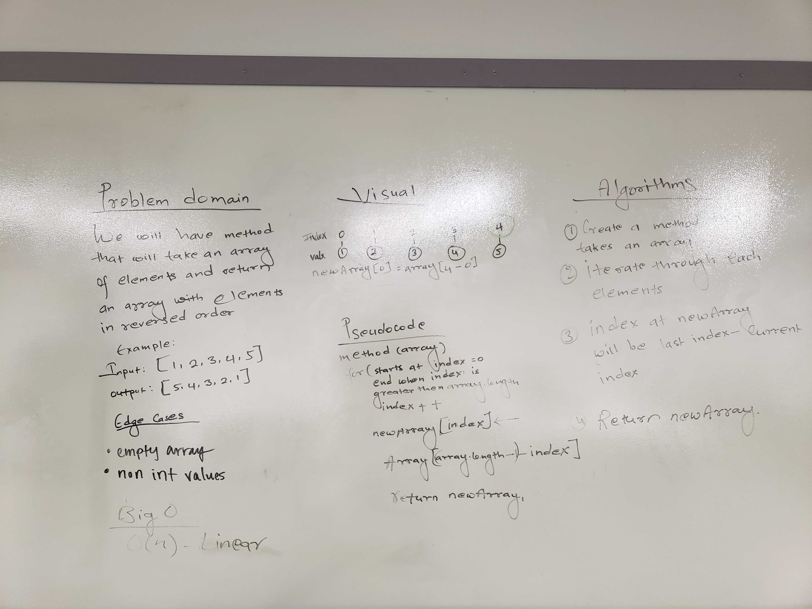

##Table of Contents
1. Reverse the Array
  

##Reverse the Array
  
##Challenge
Write a function that takes an array as argument and return an array with elements in reverse order. 

## Approach & Efficiency
To get the reverse array, I took two approaches. First, I didn't create the new array, instead I reverse the original array by doing swapping. My element was swapped to last element and second element was swapped to second last. In my second solution, I created a new array and all the elements in given array were placed reversely in new array. The Big O for this approach is linear time complexity since more numbers of elements in array takes more steps to iterate through the array. 
O(n) = Linear time complexity
  
##Solution

