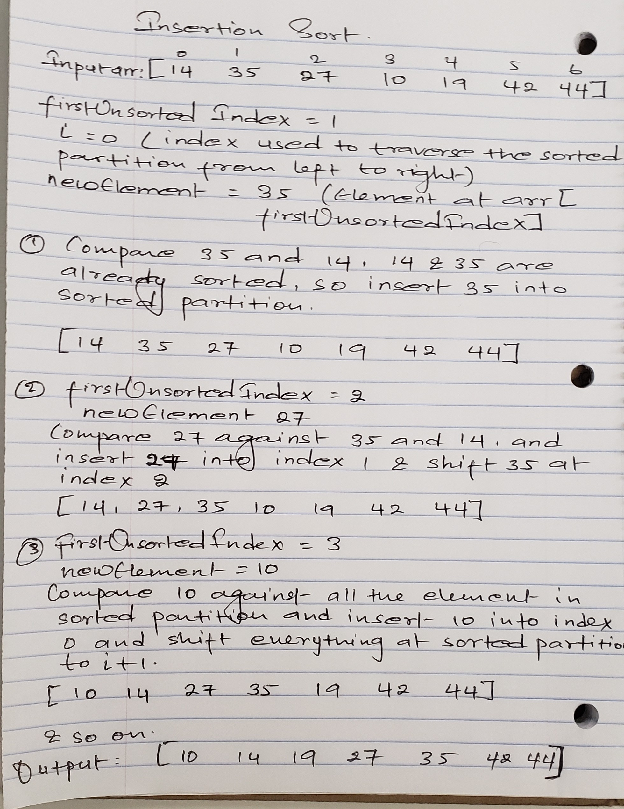
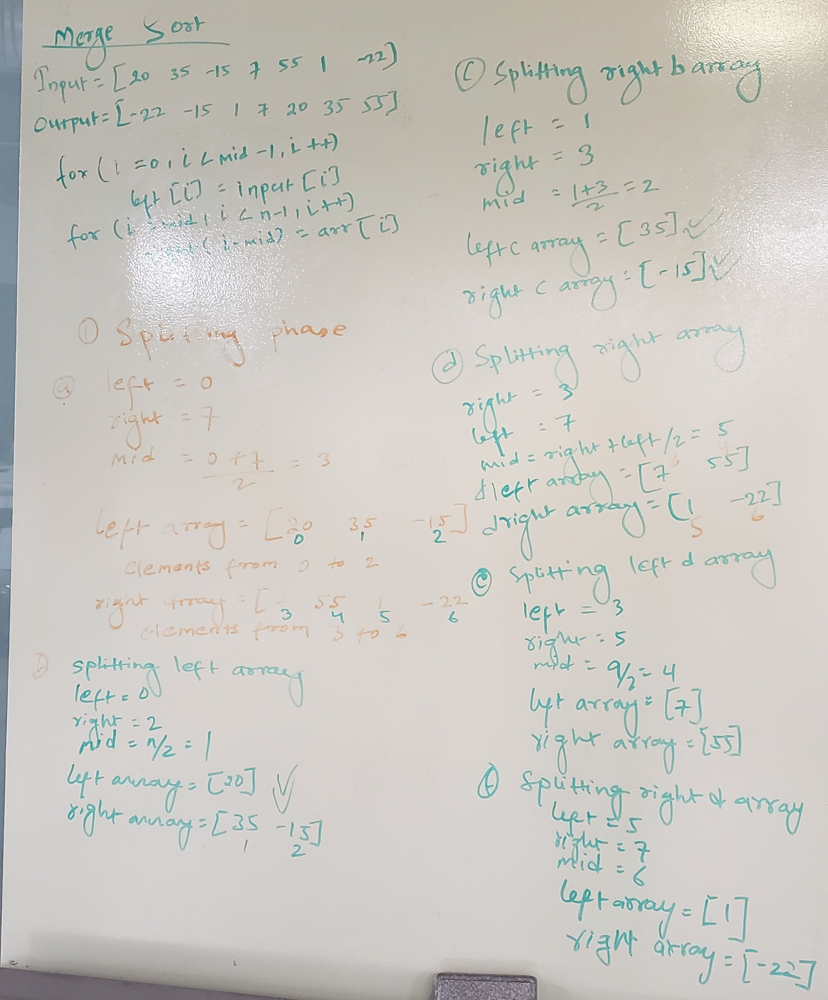

## Insertion Sort
Insertion sort algorithm is in-place algorithm, where it partitions the array into sorted and unsorted partitions. As we look for correct insertion order, sorted partition grows from left to right. It starts out as the element at index 0 is in sorted partition, and element at index 1 is in unsorted partition. On each iteration, we insert first unsorted value into sorted list. 

Unsorted Array: [14, 35, 27, 10, 19, 42, 44]
* firstUnsortedIndex = 1 (this is the first index of unsorted partition)
* i = 0 (index used to traverse the sorted partition from left to right)
* newElement = value at firstUnsortedIndex, which is 35 in this example
* Insertion sort compares 35 with value at sorted partition which is 14, it finds that 14 and 35 are already in acceding order, 35 is in sorted partition now. 
* firstUnsortedIndex moves to 27 now and compare with all the value at sorted partition and insert it.
* This process goes on until all the values at unsorted partition are in sorted partition and it breaks out of the loop. 

Sorted Array: [10, 14, 19, 27, 35, 42, 44]
#### Diagram


#### Pseudo code 
 
```
InsertionSort(int[] arr)
    input <-- int[] arr
    output <-- int[] arr
    for firstUnsortedIndex = 1 to Array.length
        new Element = arr[firstUnsortedIndex]
        for i = firstUnsortedIndex, i > 0 && arr[i - 1] > new Element, i--
            arr[i] = arr[i - 1]
        arr[i] = new Element
```
#### Efficiency
* It is in-place algorithms 
* Time Complexity: O(n^2), quadratic  
* Stable algorithm 
#### Resources 
Read
* [TutorialsPoint](https://www.tutorialspoint.com/data_structures_algorithms/insertion_sort_algorithm.htm)
* [Khan Academy](https://www.khanacademy.org/computing/computer-science/algorithms/insertion-sort/a/insertion-sort)

Video
* [udemy](https://www.udemy.com/course/data-structures-and-algorithms-deep-dive-using-java/learn/lecture/8435772?start=0#questions)


## Merge Sort
Merge sort algorithm is based on divide and conquer. It divides input array into two halves, use recursion on them and merges back the two sorted halves. It has two phases; splitting and merging 

Splitting Phase 
* Start with unsorted array
* Divide the array into two arrays; left array and right array
* Keep splitting until all the arrays have only one element left

Merging Phase
* Merge every let/right pair of siblings arrays into a sorted array
* After the first merge, there are lots of 2-element sorted arrays
* Then merge those sorted arrays into two sorted arrays
* Repeat the process until you have a single sorted array at the end
#### Diagram 


Image source: geeksforgeeks
#### Pseudo code
```
merge(arr, left, right)
    i, j, k = 0
    while(i < left.length && j < right.length)
        if(left[i] <= right[j]
            arr[k] <-- left[i]
            i <-- i + 1
        else 
            arr[k] <-- right[j]
            j <-- j + 1
        k <-- k + 1
    while(i < left.length)
            arr[k] <-- left[i]
            i <-- i + 1
            k <-- k + 1
    while(j < right.length)
            arr[k] <-- right[j]
            j <-- j + 1
            k <-- k + 1

mergeSort(arr)
    n = arr.length
    if(n > 1)
        mid = n/2
        left = array[mid]
        right = array[n - mid]
        for(i <-- 0 to mid - 1)
            left[i] <-- arr[i]
        for(i <-- mid to n-1)
            right[i - mid] <-- arr[i]
        mergeSort(left)
        mergeSort(right)
        merge(left, right, arr)

```
#### Efficiency 
* It is not an in-place algorithm 
* Time complexity in worst case is O(nlogn), we are repeatedly dividing the array into two halves in splitting phase
* It is a stable algorithm 
#### Resources 
Read
* [tutorialspoint](https://www.tutorialspoint.com/data_structures_algorithms/merge_sort_algorithm.htm)
* [geeksforgeeks](https://www.geeksforgeeks.org/merge-sort/)

Video
* [udemy](https://www.udemy.com/course/data-structures-and-algorithms-deep-dive-using-java/learn/lecture/8435790#overview)
* [merge sort algorithm](https://www.youtube.com/watch?v=TzeBrDU-JaY)

## Quick Sort
It is also a divide and conquer algorithm, so it uses recursive method.  
#### Resources 
[Quick sort merge](https://www.youtube.com/watch?v=COk73cpQbFQ&list=PL2_aWCzGMAwKedT2KfDMB9YA5DgASZb3U&index=8&t=0s)
#### Approach and Efficiency 
* It uses a pivot element to partition the array into two halves
* Elements < pivot will go to its left and elements > pivot go will got to its right
* After partition, pivot will be in its sorted position, but left and right elements are not sorted
* Above steps will repeat for left and right arrays 
* Eventually every element has been a pivot and so every element will be in sorted order

Efficiency:
* Time complexity for worst case is O(n^2)
* Time complexity for average case is O(nlogn)
* In-place algorithm
* It is an unstable algorithm
#### Pseudo code
```
Algorithm quickSort(arr, left, right)
    if(left < right)
        pIndex = partition(arr, left, right)
        quickSort(arr, left, pIndex-1)
        quickSort(arr, pIndex + 1, right)

Algorithm partition(arr, left, right)
    pivot = arr[end]
    pIndex = left - 1
    for i <-- start to end 
        if(arr[i] <= pivot
            swap(arr, i, pIndex)
    swap(arr, right, pIndex+1)
    return pIndex

Algorithm swap(arr, i, pIndex)
        temp = arr[i]
        arr[i] = arr[pIndex]
        arr[pIndex] = temp

```

#### Solution
[Code](src/main/java/code401challenges/sort/Quick.java) |
[Test](src/test/java/code401challenges/sort/QuickTest.java) |
[Blog](../code401challenges/BLOG.md)


