### 1. Reverse the Array
    
#### Challenge
Write a function that takes an array as argument and return an array with elements in reverse order. 

#### Approach & Efficiency
To get the reverse array, I took two approaches. First, I didn't create the new array, instead I reverse the original array by doing swapping. My element was swapped to last element and second element was swapped to second last. In my second solution, I created a new array and all the elements in given array were placed reversely in new array. The Big O for this approach is linear time complexity since more numbers of elements in array takes more steps to iterate through the array. 
O(n) = Linear time complexity
    
#### Solution
[code](src/main/java/code401challenges/ArrayReverse.java)
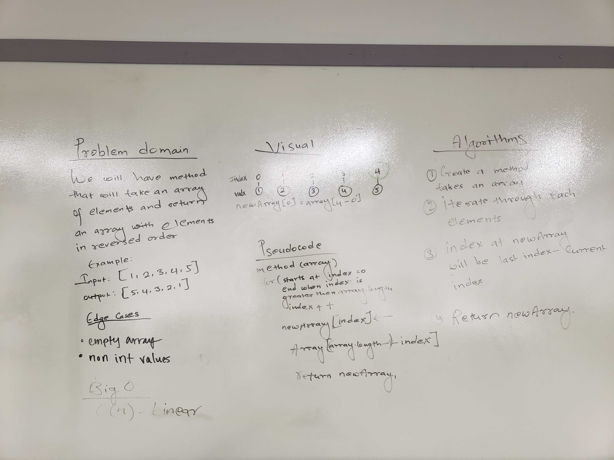

  
### 2. Insert and shift an array in middle at index
  
#### Challenge
Write a function called insertShiftArray which takes two parameters arr and the valued to be added. 

#### Source
Pair programmed with Merisha
  
#### Approach & Efficiency 
To insert the value at the middle of the array, I find the mid point. If my index at new array is less than mid point, i copied same element from output array to new array. If the index at new array is midpoint, then I insert the value. If index is greater then midpoint, it copied element from input array at index - 1. Both time and space complexity is O(n). 

#### Solution
[code](src/main/java/code401challenges/ArrayShift.java)|[Test](src/test/java/code401challenges/ArrayShiftTest.java)
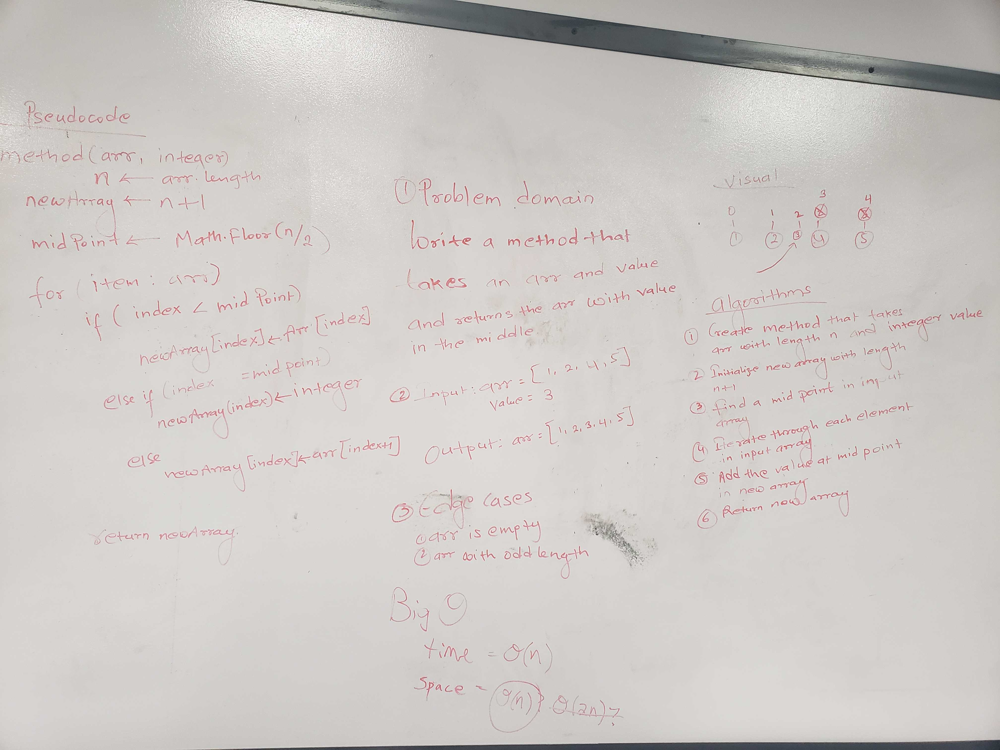


### 3. Binary Search 
  
#### Challenge
Write a method called BinarySearch which takes two parameters sorted array and search key and return the index of the key of found. Return -1 when  not found.

#### Source
https://www.udemy.com/data-structures-and-algorithms-deep-dive-using-java/learn/lecture/8435910#content
#### Approach & Efficiency
1. Array must be sorted
2. Find the mid point of the array and compares it against search key
3. If element at mid index is equal to search key, return mid index
4. If the element is greater than search key, search the left half of the array
5. If the element is less than the search key, search the right half of the array
6. If not found return -1

#### Solution
[code](src/main/java/code401challenges/BinarySearch.java)
[Test](src/test/java/code401challenges/BinarySearchTest.java)
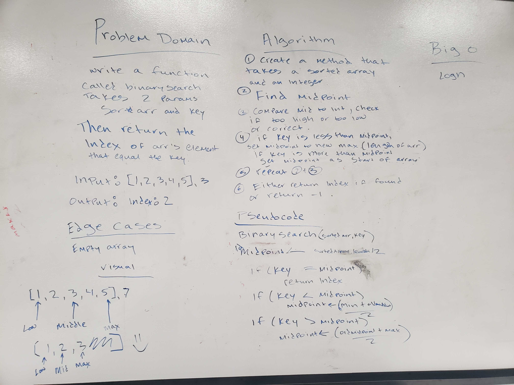

### 4. Linked List
#### Challange 
Create a Node class that has properties for the value stored in the Node, and a pointer to the next Node. Within your LinkedList class, include a head property. Upon instantiation, an empty Linked List should be created. 

#### Method
```
insert()
include()
toString()
```
  
#### Solution 
[Code](src/main/java/code401challenges/linkedlist)
[Test](src/test/java/code401challenges/linkedlist/LinkedListTest.java)


### 5.Linked Class
#### Challenge
Create a methods which add new node with given value at the end of the linked list. Also create methods called addAfter and addBefore.

#### Approach and Efficiency
1. Given the value, create a new node and add at the end of the LL
2. Locate current node
3. Attach new node to end
2. Create an adaBefore method 
3. Create an addAfter method 

#### Solution 
[Code](src/main/java/code401challenges/linkedlist)
[Test](src/test/java/code401challenges/linkedlist/LinkedListTest.java)
  


#### 6. k-th value from the end of a linked list.
#### Challenge 
Write a method for the Linked List class which takes a number, k, as a parameter. Return the node’s value that is k from the end of the linked list. You have access to the Node class and all the properties on the Linked List class as well as the methods created in previous challenges.

#### Source
https://junit.org/junit4/faq.html#atests_7
https://www.geeksforgeeks.org/nth-node-from-the-end-of-a-linked-list/
#### Approach and Efficiency 
1. Use two pointers; current and main and initialize both at head
2. First move current pointer to kth element from head
3. Now move both pointers one by one until main pointer reach to the end
4. Now the main pointer will point to nth node from the end. Return the main pointer.

#### Solution 
[Code](src/main/java/code401challenges/linkedlist)
[Test](src/test/java/code401challenges/linkedlist/LinkedListTest.java)

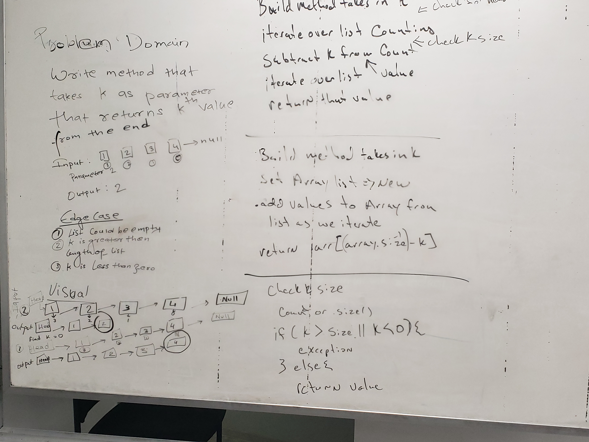

## 7: Merge two linked lists.
#### Challenge 
Write a method that takes two linked lists as parameters, merge them together and return reference to the head of single merged linked list.

#### Approach and Efficiency
1. Use two pointers both reference to the head of first node, but move only one while another one always point to the haed of first list.
2. If the first list is empty, return second one, if second one is empty, return first one.
3. While both are not empty, When current first is moved to current second, move one pointer the current second also
4. When moving  pointer hit the null, return another pointer referencing to head of first list. 

Time Complexity = O(n)
Space Complexity = O(1)
#### Solution
[Code](src/main/java/code401challenges/linkedlist)
[Test](src/test/java/code401challenges/linkedlist/LinkedListTest.java)

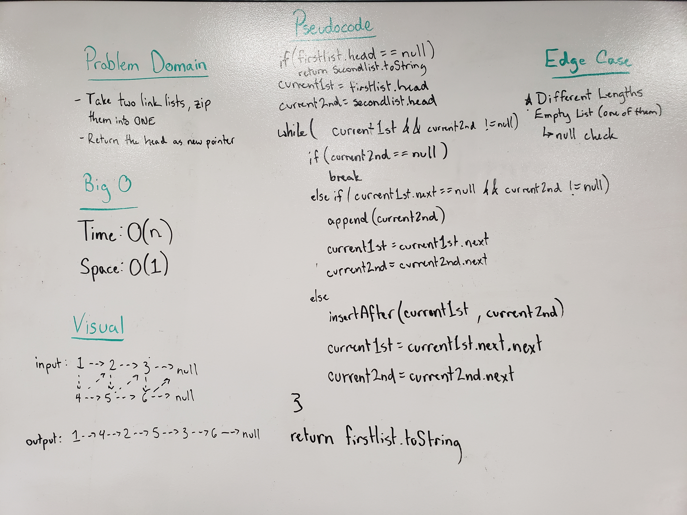

## 8: Implement a Stack and a Queue Data Structure
#### Challenge 
Create node, stack and queue classes and implement top, push, pop, peek, front, enqueue, dequeue, and peek methods.

#### Approach and Efficiency
1. Create a Node class with value and next node
2. Create Stack class that defines methods called push, pop, and peek
3. Create Queue class that defines methods called Enqueue, Dequeue, and peek

Time complexities of all these methods are O(1)

#### Solution 
[Code for Stack](src/main/java/code401challenges/stacksandqueues/Stack.java) |
[Test for Stack](src/test/java/code401challenges/stacksandqueues/StackTest.java)
  
[Code for Queue](src/main/java/code401challenges/stacksandqueues/Queue.java) |
[Test for Queue](src/test/java/code401challenges/stacksandqueues/QueueTest.java)


## 9: Implement a Queue using two Stacks
#### Challenge 
Create a brand new PseudoQueue class. Do not use an existing Queue. Instead, this PseudoQueue class will implement our standard queue interface (the two methods listed below), but will internally only utilize 2 Stack objects

#### Approach and Efficiency 
1. Create a method that takes 2 stacks as parameters 
2. Create enqueue method to push value in one stack1
3. Create dequeue method to pop value from stack2

Time complexity: for Enqueue is O(1)
Time complexity: for Dequeue is O(n)

#### Solution
[Code](src/main/java/code401challenges/stacksandqueues/PseudoQueue.java)  |
[Test](src/test/java/code401challenges/stacksandqueues/PseudoQueueTest.java)
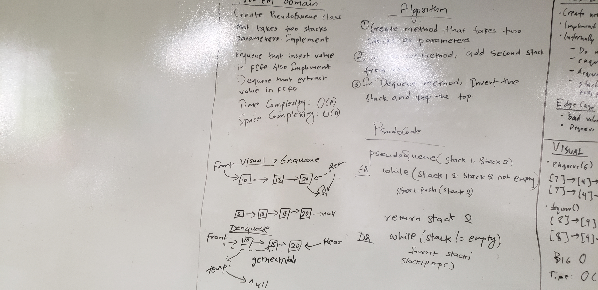

## 10. First-in, First out Animal Shelter.
#### Challenge
* Create a class called AnimalShelter that takes Animal Object with dog and cat type
* Implement enqueue method that takes Animal type and add it at dog queue or cat queue
* Implement dequeue method that takes animal type and remove from type queue

#### Approach and Efficiency 
1. Create class called Animal with type field
2. Create AnimalShelter class that implement and enqueue and dequeue methods on cat Queue and dog queue

Enqueue method
  
Time Complexity: O(1)
  
Space Complexity: O(1)

Dequeue method
  
Time Complexity: O(1)
  
Space Complexity: O(1)

#### Solution 
[Code](src/main/java/code401challenges/utilities) |
[Test](src/test/java/code401challenges/utilities/AnimalShelterTest.java)
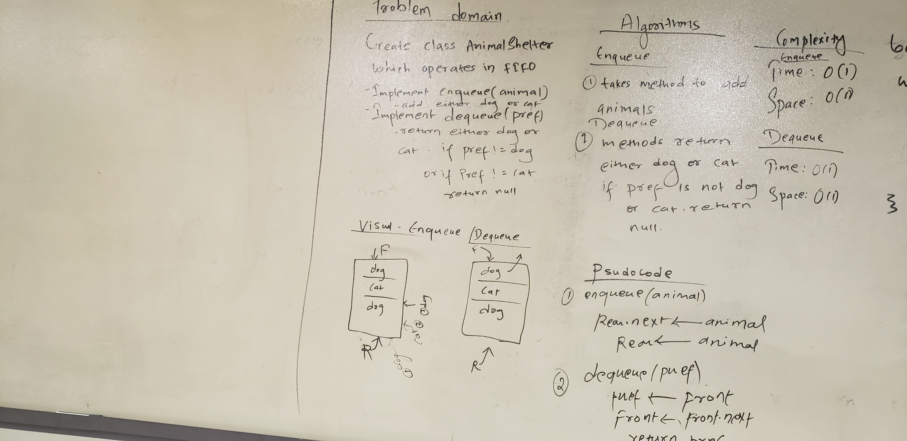

## lab11: Multi-bracket Validation
#### Challenge
Write a function should take a string as its only argument, and should return a boolean representing whether or not the brackets in the string are balanced


#### Approach and Efficiency 
1. Create a empty character stack 
2. Traverse through each character of input string 
3. If the character is opening bracket; (, {, [, push it to the stack
4. If the character is closing bracket; ), }, ], pop opening bracket from stack and match to see if they are the set, and return true.
5. After complete traversal, if there is some starting bracket left in stack then return false

Time and Space Complexity: O(n) and O(n) for crating stack

#### Solution
[Code](src/main/java/code401challenges/utilities/MultiBracketValidation.java) |
[Test](src/test/java/code401challenges/utilities/MultiBracketValidationTest.java)
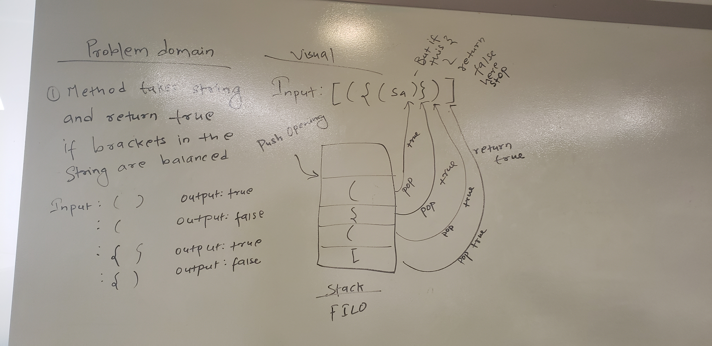

## lab15: Trees
#### Resources 
Source: https://www.udemy.com/course/data-structures-and-algorithms-deep-dive-using-java/learn/lecture/8435914#content
  
Classmate: Padma 
#### Challenge
Implement Binary tree

#### Approach 
1. Create Node class with data, left child and right child 
2. Create Tree class with root and also has in-order, pre-order, and post-order traverse methods
3. Create Binary Search Tree with add and contain methods and it also extends Tree class in order to access Traverse methods

#### Solution 
[Code](src/main/java/code401challenges/tree/BinarySearchTree.java) |
[Test](src/test/java/code401challenges/tree/BinarySearchTreeTest.java)

## 16.Code challenge: fizzBuzz in Tree
#### Challenge
Write a function called FizzBuzzTree which takes a tree as an argument.
Without utilizing any of the built-in methods available to your language, determine weather or not the value of each node is divisible by 3, 5 or both, and change the value of each of the nodes:
* If the value is divisible by 3, replace the value with “Fizz”
* If the value is divisible by 5, replace the value with “Buzz”
* If the value is divisible by 3 and 5, replace the value with “FizzBuzz”
Return the tree with its new values.

#### Approach
1. Create a helper function that takes node with generic type 
2. If current node is not null, it will compare the value and replace them appropriately
3. Call the same function recursively on left and right node
4. Create another function that takes tree as argument and return tree of object type
5. Inside this function, helper function is called on root of that tree. 

Time Complexity: O(1)
Space Complexity: O(n)

#### Solution 
[Code](src/main/java/code401challenges/utilities/FizzBuzzTree.java) |
[Test](src/test/java/code401challenges/utilities/FizzBuzzTreeTest.java)
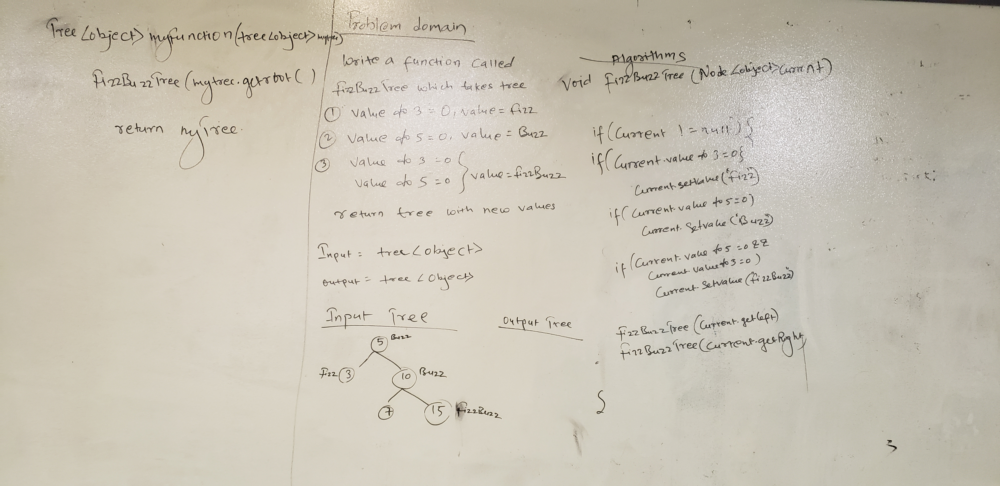

## 17. Breadth-first Traversal.
#### Challenge
Do the breadth-first traverse on the binary tree 
  
#### Approach 
1. Write method which takes tree and return array list of node value
2. Create empty queue and add the root of the tree
3. Instantiate empty array list
4. While the root is not empty, remove the root from queue and add left and right child in the queue at the same time. 
Time Complexity: O(1)
Space Complexity: O(n)
#### Solution
[Code](src/main/java/code401challenges/tree/Tree.java) |
[Test](src/test/java/code401challenges/tree/TreeTest.java)
  
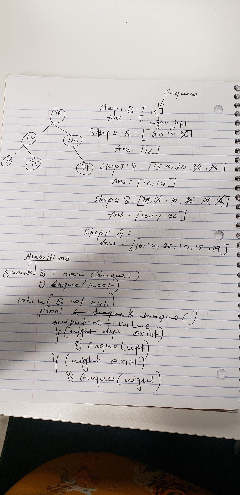

## 18. Find the Maximum Value in a Binary Tree
#### Challenge 
Write a method that takes root of the tree and find the maximum value in that binary tree.

#### Resources
* https://www.udemy.com/course/data-structures-and-algorithms-deep-dive-using-java/learn/lecture/8435916?start=15#content

#### Approach and Efficiency 
1. Write a method that takes root and return int value
2. If root is null return min value of Integer
3. Assign the root value on output
3. Call the methods  recursively on left child and assign max value on output left
4. Call the methods recursively on right child and assign max value on output right 
5. Compare right and left value against output, reassign max vale  and return output

Time Complexity: O(n)

Space Complexity: O(1)

#### Solution
[Code](src/main/java/code401challenges/tree/Tree.java) |
[Test](src/test/java/code401challenges/tree/TreeTest.java)
  
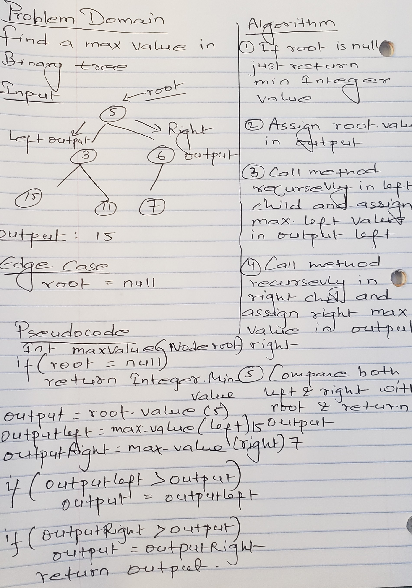